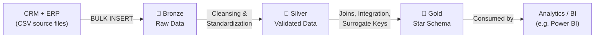

## Overview

The project loads raw CRM and ERP files, refines them through three layers, and exposes the result for reporting:



| Layer | Purpose | Object Type |
|---|---|---|
| **Bronze** | Raw ingestion, no transformation | Tables |
| **Silver** | Data cleansing, standardization, business rules | Tables |
| **Gold** | Business-ready dimensional model (Star Schema) | Views |

## Tech Stack

- SQL Server / T-SQL
- SQL Server Management Studio (SSMS)
- Git & GitHub

## Repository Structure

```
sql-data-warehouse-project/
├── datasets/
│   ├── source_crm/
│   └── source_erp/
├── docs/
│   ├── data_architecture.md
│   ├── data_catalog.md
│   ├── data_flow.md
│   ├── data_integration.md
│   ├── data_model.md
│   └── naming_conventions.md
├── scripts/
│   ├── bronze/
│   ├── silver/
│   └── gold/
└── tests/
    ├── quality_checks_silver.sql
    └── quality_checks_gold.sql
```

## Documentation

- [Data Architecture](docs/data_architecture.md)
- [Data Model](docs/data_model.md)
- [Data Flow](docs/data_flow.md)
- [Data Integration](docs/data_integration.md)
- [Data Catalog](docs/data_catalog.md)
- [Naming Conventions](docs/naming_conventions.md)

## How It Works

1. **Bronze layer**: Source CSV files are loaded as-is into raw tables using `BULK INSERT`.
2. **Silver layer**: Data is cleaned, deduplicated, and standardized (e.g., unifying codes like `M`/`F` into `Male`/`Female`, fixing invalid dates, recalculating inconsistent sales figures) via a stored procedure (`silver.load_silver`).
3. **Gold layer**: Clean data is joined, integrated across source systems, and exposed as views (`dim_customers`, `dim_products`, `fact_sales`) using surrogate keys — ready for reporting and analytics.

## About This Project

This project was built as a hands-on learning exercise while following [Data With Baraa](https://www.youtube.com/@DataWithBaraa)'s SQL Data Warehouse course, with all scripts debugged, adapted, and documented independently.

## Author

**Fatima Setorgi**
[LinkedIn](https://linkedin.com/in/fatima-setorgi) · [GitHub](https://github.com/fatimastr)
```
