# Data Architecture — Medallion Architecture (Bronze / Silver / Gold)

This project follows the Medallion Architecture pattern, organizing data into three progressively refined layers within a single SQL Server database (`DataWarehouse`), using separate schemas.

```mermaid
flowchart LR
    subgraph Sources["Source Systems"]
        CRM["CRM<br/>(3 CSV files)"]
        ERP["ERP<br/>(3 CSV files)"]
    end

    subgraph Bronze["🥉 bronze schema"]
        B1["crm_cust_info"]
        B2["crm_prd_info"]
        B3["crm_sales_details"]
        B4["erp_cust_az12"]
        B5["erp_loc_a101"]
        B6["erp_px_cat_g1v2"]
    end

    subgraph Silver["🥈 silver schema"]
        S1["Cleansed & standardized<br/>equivalents of Bronze tables"]
    end

    subgraph Gold["🥇 gold schema"]
        G1["dim_customers"]
        G2["dim_products"]
        G3["fact_sales"]
    end

    CRM -->|BULK INSERT| Bronze
    ERP -->|BULK INSERT| Bronze
    Bronze -->|"Cleansing, standardization,<br/>business rules (Stored Procedure)"| Silver
    Silver -->|"Joins, integration,<br/>surrogate keys (Views)"| Gold
    Gold -->|Consumed by| BI["Analytics / BI Tools<br/>(e.g., Power BI)"]
```

## Layer Responsibilities

| Layer | Responsibility | Object Type | Load Method |
|---|---|---|---|
| **Bronze** | Raw ingestion, no transformation | Tables | `BULK INSERT` (Stored Procedure) |
| **Silver** | Data cleansing, standardization, business rule validation | Tables | `INSERT ... SELECT` (Stored Procedure) |
| **Gold** | Business-ready star schema (dimensional model) | Views | Computed on query (always up to date) |

## Naming Conventions

- Bronze/Silver tables: `<source_system>_<entity>` (e.g., `crm_cust_info`)
- Gold dimension views: `dim_<entity>` (e.g., `dim_customers`)
- Gold fact views: `fact_<entity>` (e.g., `fact_sales`)
- Surrogate keys: `<entity>_key` (e.g., `customer_key`)
- Metadata columns: `dwh_<purpose>` (e.g., `dwh_create_date`)
