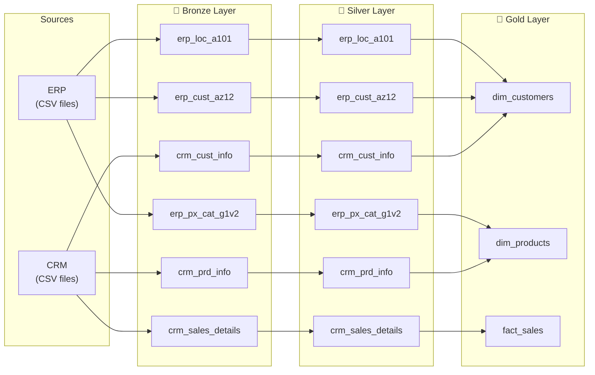

# Data Flow (Lineage)

This diagram shows how every table travels from the source files to the final Gold views: which Bronze table feeds which Silver table, and which Silver tables are combined to build each Gold view. It answers the question "where did this number come from?".

## How Gold views are built

| Gold view | Built from (Silver tables) |
|---|---|
| `gold.dim_customers` | `crm_cust_info` + `erp_cust_az12` + `erp_loc_a101` |
| `gold.dim_products` | `crm_prd_info` + `erp_px_cat_g1v2` |
| `gold.fact_sales` | `crm_sales_details` (joined with the two dimensions to look up `product_key` and `customer_key`) |

Between Bronze and Silver every table maps one-to-one. Tables are only combined in the Gold layer.
