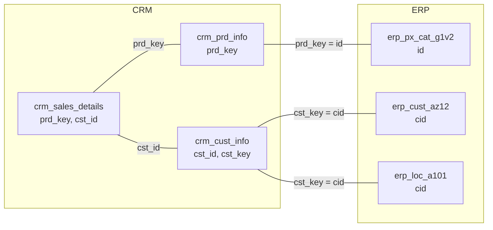

# Data Integration (How Source Tables Are Related)

This diagram shows which columns connect the CRM and ERP tables to each other. These keys are what the Gold layer uses to join the tables together, for example when building `dim_customers` and `dim_products`.

## Join Keys

| Table A | Table B | Joined on | Business meaning |
|---|---|---|---|
| `crm_sales_details` | `crm_prd_info` | `prd_key` | Which product was sold |
| `crm_sales_details` | `crm_cust_info` | `cst_id` | Which customer bought |
| `crm_prd_info` | `erp_px_cat_g1v2` | `prd_key = id` | Product category details |
| `crm_cust_info` | `erp_cust_az12` | `cst_key = cid` | Customer birthdate (and gender) |
| `crm_cust_info` | `erp_loc_a101` | `cst_key = cid` | Customer country |
