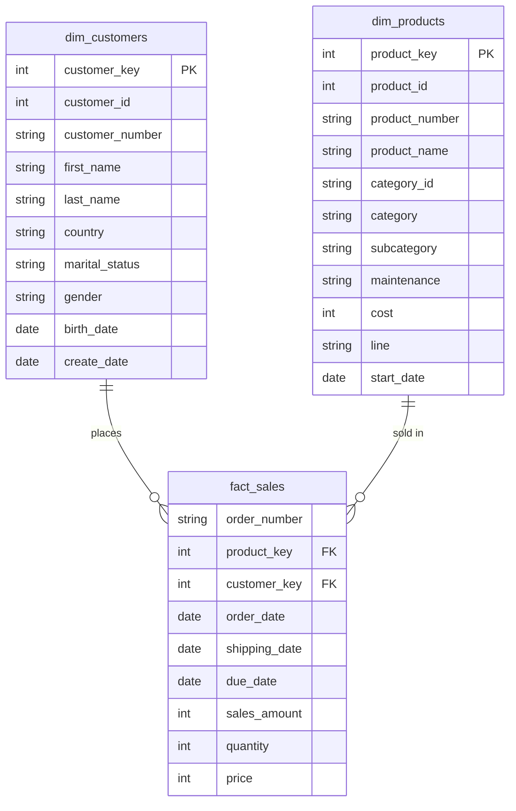

# Data Model — Star Schema (Gold Layer)

The Gold layer implements a **Star Schema**: one central fact table surrounded by dimension tables, connected via surrogate keys.

## Why a Star Schema?

- **Simplicity:** Easy to understand and query — ideal for BI tools like Power BI.
- **Performance:** Fewer joins required compared to a normalized (Snowflake) schema.
- **Trade-off accepted:** Some redundancy in dimension tables, but storage cost is negligible for this use case.

## Relationship Type

Every dimension-to-fact relationship is **one-to-many**: one customer can appear in many sales records; one product can appear in many sales records. This is why `LEFT JOIN` is used consistently when building the Gold layer views — to avoid losing dimension records that (temporarily) have no matching transactions.

## Surrogate Keys

Each dimension has a surrogate key (`customer_key`, `product_key`) generated within the warehouse using `ROW_NUMBER()`, independent of the source system's original identifiers. The fact table references dimensions exclusively through these surrogate keys (a process called **data lookup**), not through the original source keys.
