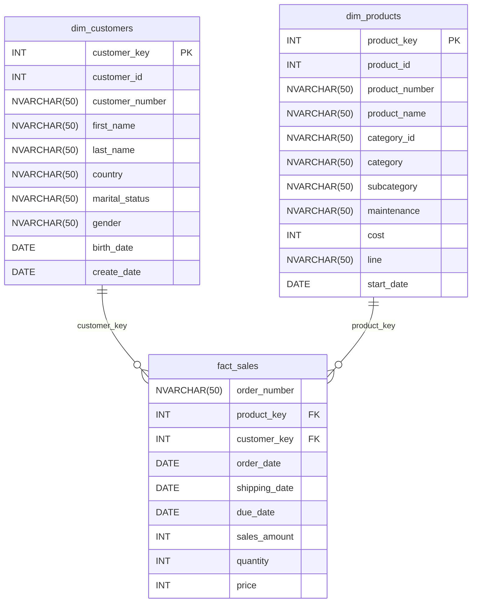

# Data Model — Sales Data Mart (Star Schema)

The Gold layer is modeled as a **star schema**: one central fact table (`fact_sales`) that stores the sales events, surrounded by two dimension tables (`dim_customers`, `dim_products`) that describe *who* bought and *what* was bought.

```mermaid
erDiagram
    dim_customers ||--o{ fact_sales : "customer_key"
    dim_products  ||--o{ fact_sales : "product_key"

    dim_customers {
        INT customer_key PK
        INT customer_id
        NVARCHAR(50) customer_number
        NVARCHAR(50) first_name
        NVARCHAR(50) last_name
        NVARCHAR(50) country
        NVARCHAR(50) marital_status
        NVARCHAR(50) gender
        DATE birth_date
        DATE create_date
    }

    dim_products {
        INT product_key PK
        INT product_id
        NVARCHAR(50) product_number
        NVARCHAR(50) product_name
        NVARCHAR(50) category_id
        NVARCHAR(50) category
        NVARCHAR(50) subcategory
        NVARCHAR(50) maintenance
        INT cost
        NVARCHAR(50) line
        DATE start_date
    }

    fact_sales {
        NVARCHAR(50) order_number
        INT product_key FK
        INT customer_key FK
        DATE order_date
        DATE shipping_date
        DATE due_date
        INT sales_amount
        INT quantity
        INT price
    }
```

## Table Roles

| Table | Type | Grain / Content |
|---|---|---|
| `gold.fact_sales` | Fact | One row per order line (one product within one sales order) |
| `gold.dim_customers` | Dimension | One row per customer |
| `gold.dim_products` | Dimension | One row per current product |

## Relationships

- One customer can appear in many sales rows (`dim_customers.customer_key` → `fact_sales.customer_key`).
- One product can appear in many sales rows (`dim_products.product_key` → `fact_sales.product_key`).

## Business Rule

`sales_amount = quantity * price`

For column-level descriptions, see the [Data Catalog](data_catalog.md).
